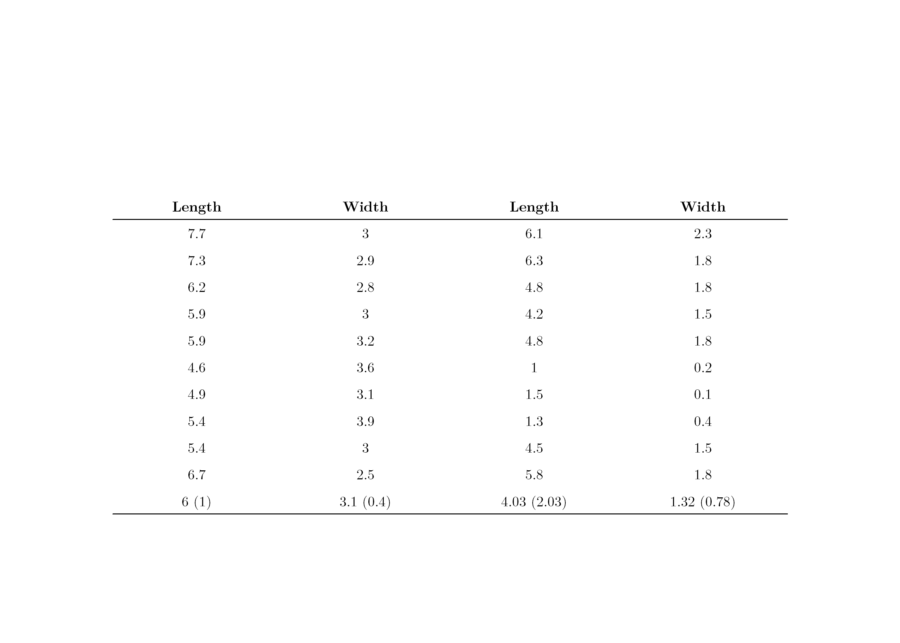
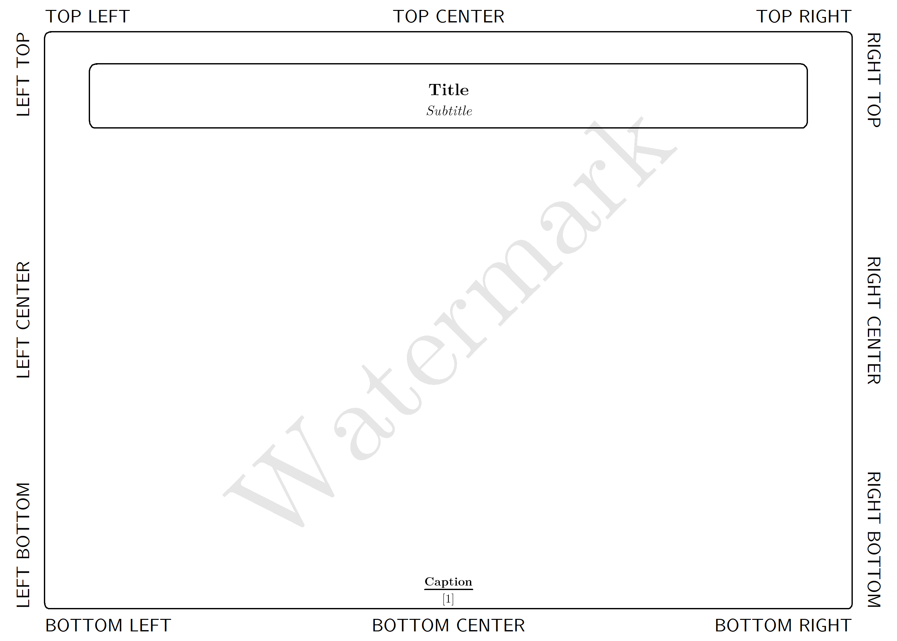
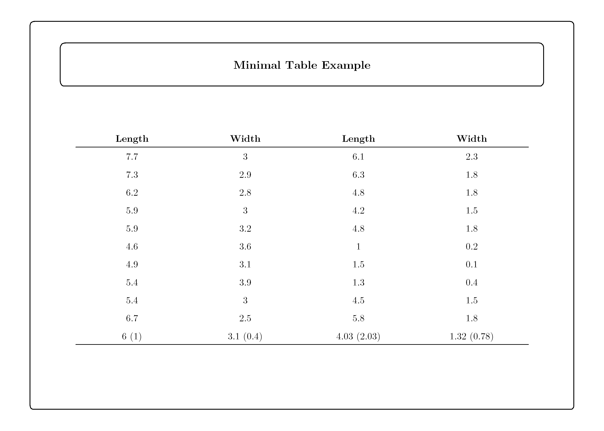
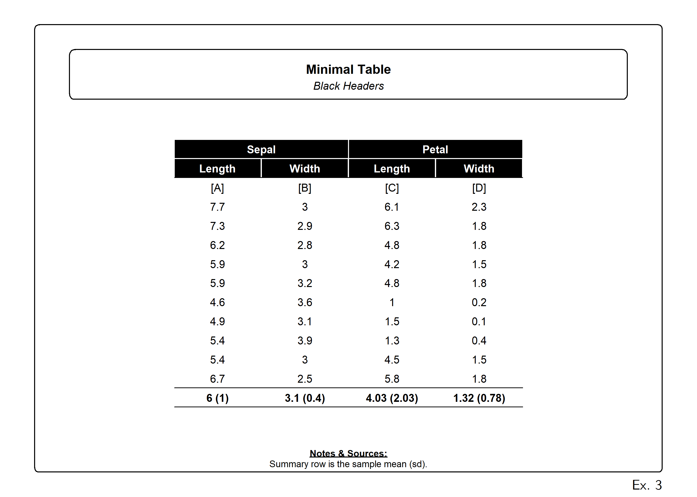
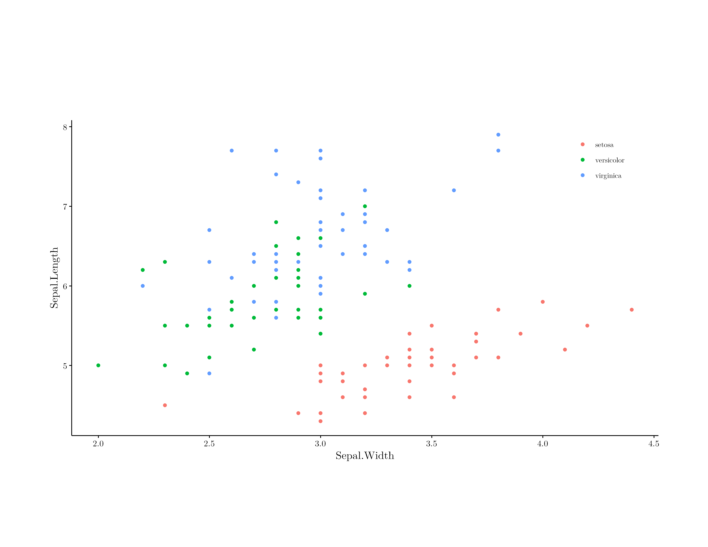

<!-- README.md is generated from README.Rmd. Please edit that file -->

# grid.table.minimal

<!-- badges: start -->

<!-- badges: end -->

The goal of grid.table.minimal is to quickly format grid graphics based
tables and plots.

## Installation

You can install the development version of grid.table.minimal from
[GitHub](https://github.com/) with:

``` r
# install.packages("pak")
pak::pak("DannyMRoss/grid.table.minimal")
```

## Examples

``` r
library(grid.table.minimal)
library(dplyr)
library(ggplot2)
library(data.table)
library(extrafont)
library(showtext)
library(grid)
library(gridExtra)
library(gtable)
set_border_defaults()
loadfonts()
```

#### summary table for examples

``` r
setDT(iris)
DT <- iris[sample(.N, 10), 1:4]
DT <- rbind(DT, 
            DT[, lapply(.SD, function(x) paste0(mean(x), " (",round(sd(x),2),")"))])
setnames(DT, rep(c("Length","Width"),2))
print(DT)
#>         Length       Width      Length       Width
#>         <char>      <char>      <char>      <char>
#>  1:        4.4           3         1.3         0.2
#>  2:        5.5         3.5         1.3         0.2
#>  3:          5         2.3         3.3           1
#>  4:        4.6         3.1         1.5         0.2
#>  5:        5.7         2.8         4.5         1.3
#>  6:        5.6         2.8         4.9           2
#>  7:        6.3         3.4         5.6         2.4
#>  8:        6.7           3           5         1.7
#>  9:        6.8           3         5.5         2.1
#> 10:        5.4         3.4         1.7         0.2
#> 11: 5.6 (0.82) 3.03 (0.36) 3.46 (1.84) 1.13 (0.89)
```

## Example 1

### grid.table.minimal() converts a data.frame to a gtable object with minimalist formatting applied. The gtable can then be drawn to the graphics device with grid.draw()

``` r
g <- grid.table.minimal(DT)
grid.draw(g)
```



### grid.borders() draws borders, title, subtitle, caption, and watermark to the graphics device

``` r
grid.borders(
  bottom = c(l="BOTTOM LEFT", c="BOTTOM CENTER", r="BOTTOM RIGHT"), 
  top = c(l="TOP LEFT", c="TOP CENTER", r="TOP RIGHT"),
  left = c(b="LEFT BOTTOM", c="LEFT CENTER", t="LEFT TOP"),
  right = c(b="RIGHT BOTTOM", c="RIGHT CENTER", t="RIGHT TOP"),
  title = "Title",
  subtitle = "Subtitle",
  caption = list("Caption" = c("[1]")),
  watermark = "Watermark"
)
```



### draw borders over the gtable

``` r
grid.draw(g)
grid.borders(title = "Minimal Table Example")
```



### grid.table.minimal() and grid.borders() rely on global options that are set to default values by the below function.

``` r
set_border_defaults(show = TRUE)
#> $plot.width
#> [1] 11
#> 
#> $plot.height
#> [1] 8.5
#> 
#> $plot.sep
#> [1] 0.02
#> 
#> $caption.margin
#> [1] 0.05
#> 
#> $border.margin
#> [1] 0.05
#> 
#> $border.radius
#> [1] 0.009
#> 
#> $title.margin
#> [1] 0.05
#> 
#> $title.radius
#> [1] 0.1
#> 
#> $title.width
#> [1] 0.8
#> 
#> $title.height
#> [1] 0.1
#> 
#> $title.sep
#> [1] 0.011
#> 
#> $fontsize
#> [1] 12
#> 
#> $border.fontsize
#> [1] 12
#> 
#> $border.fontfamily
#> [1] "CMU Sans Serif"
#> 
#> $default.fontfamily
#> [1] "LM Roman 10"
#> 
#> $title.fontface
#> [1] "bold"
#> 
#> $subtitle.fontface
#> [1] "italic"
```

### example save to pdf usage

``` r
set_border_defaults(plot.width = 8.5, plot.height = 11, fontsize=16)
pdf("man/figures/table1.pdf", width = getOption("plot.width"), height = getOption("plot.height")) # start pdf stream
grid.slip(label = "Ex. 1") # draws a slip sheet
grid.draw(grid.table.minimal(DT))
grid.borders(title = "Minimal Table Example", bottom = c(l="",c="",r="Ex. 1"))
invisible(dev.off()) # close pdf stream
```

[man/figures/table1.pdf](man/figures/table1.pdf)

## Example 2

### gtables can be easily and flexibly formatted with the below functions

``` r
# use grid.table.minimal() to convert DT to gtable object w/ minimal styling applied
g <- grid.table.minimal(DT)
# add column header spans with gtable_add_cspan()
g <- gtable_add_cspan(g, text="Sepal", r=2) # defaults to adding above 
g <- gtable_add_cspan(g, text="Petal", t=1, b=1, l=3, r=4) # specify t=b=1 to add to the existing top row
g <- gtable_add_cspan(g, text="Iris Random Sample (N = 10)")
# add horizontal lines with gtable_add_hline()
g <- gtable_add_hline(g, rows = nrow(g)-1) # adds hline(s) below row(s)
# format rows/cols/cells with grid.table.gp()
g <- grid.table.gp(g, rows = nrow(g), bold=T) # bold quickly with bold parameter
# individual cell formatting
g <- grid.table.gp(g, 
                   cols = c(1,3), 
                   rows = nrow(g), 
                   union = FALSE, # only apply to intersection of cols/rows
                   name = 'core-bg', # modify background grobs
                   gp_params = list(fill = "#DEEBF7"))
# draw gtable to device
grid.draw(g)
# draw borders, titles, caption, to device
grid.borders(title = "Minimal Table Example",
             subtitle = "flexible formatting",
             caption = list("Notes" = c("Summary row is the sample mean (sd).")),
             bottom = c(l="",c="",r="Ex. 2"), # add bottom margin text
             top = c(l = "", c="", r="")) # add top margin text
```


## Example 3

### shortcuts are available to white-on-black the column headers

``` r
set_border_defaults(default.fontfamily="Arial", fontsize=8, border.fontsize=10) # change default font and fontsize
g <- grid.table.minimal(DT, 
                        width_pct = .5, # pct of page that the table will take up
                        black.heading = TRUE) # black heading option
g <- gtable_add_cspan(g, text="Sepal", r=2, black = TRUE) 
g <- gtable_add_cspan(g, text="Petal", t=1, b=1, l=3, r=4, black = TRUE)
g <- gtable_add_hline(g, rows = nrow(g)-1)
g <- grid.table.gp(g, rows = nrow(g), bold=T)
grid.draw(g)
grid.borders(title = "Minimal Table",
             subtitle = "Black Headers",
             caption = list("Notes & Sources:" = c("Summary row is the sample mean (sd).")),
             bottom = c(l="",c="",r="Ex. 3"),
             top = c(l = "", c="", r=""))
```



# theme_borders()

``` r
source("R/theme_borders.R")
```

### Use ggplot theme_borders() to add minimalist formatting to ggplots and set margins compatible with grid.borders()

Space above the plot is preserved for the title, subtitle, and caption
labels to be added with `grid.borders()`

``` r
set_border_defaults()
p <- ggplot(iris, aes(x=Sepal.Width, y=Sepal.Length, color=Species)) + 
  geom_point() + 
  theme_borders()
grid.draw(p)
```



### Add titles, caption, borders and write to pdf

``` r
pdf("man/figures/plot1.pdf", width=getOption("plot.width"), height=getOption("plot.height"))
grid.draw(p)
grid.borders(
  title = "Title",
  subtitle = "Subtitle",
  caption = list("Caption" = c("[1]")),
  bottom = c(l="", c="", r="Ex. 1")
)
invisible(dev.off())
```

[man/figures/plot1.pdf](man/figures/plot1.pdf)
